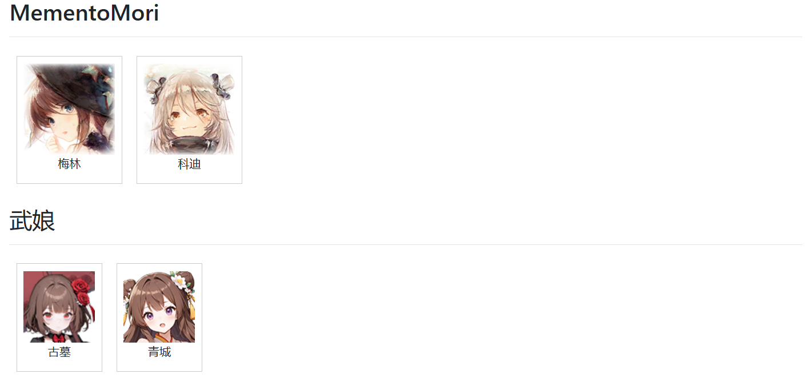

# game-model-display
展示游戏的live2d和spine模型
Display live2d and spine model in web
本项目不是模型存储仓库，模型请自行寻找
This project is not a model storage repository. Please find models elsewhere.



## 分支介绍 Branch Introduce
- main
  项目的主要分支，会一直维护
- fixed-img-button-open-sidebar
  通过一个右下角按钮来展示角色，这样主页面就可以做各种别的东西

## 项目结构 Code Structure
```txt
docs（开发笔记等和功能无关的内容）
lib（css和js依赖库）
resource（模型存放位置，里面的结构参考template）
static（非模型的静态文件存放位置）
template（模型文件结构模板）
tools（一些和主要功能无关的辅助工具）
data.js（由tools/build_resource_data.py生成的js文件）
favicon.ico
index.html
main.js
```

## 项目的一些遗憾 Something Imperfect
本项目未能实现同时播放Live2d模型两个MotionGroup中的Motion，采用了一个取巧的方法：分别用两个模型分别同时播放Motion。这带来了一些遮挡问题，导致实际效果与游戏中的效果有一些偏差。
据说在cubism 5中可以通过创建两个layer，分别播放两个Motion来解决这个问题。目前pixi-live2d-display还不支持cubism 5，我没有能力和兴趣去应用cubism 5。如果以后有方便的js cubism 5方案，我会进行适配。

## 使用方法 Usages
### 前置准备 Prepare
如果修改过resource目录中的东西，运行tools/build_resource_data.py生成data.js，或者手动修改data.js。
（运行tools/build_resource_data.py需要安装python；注意清除浏览器缓存）

### 启动 Run
windows下，创建如下bat文件
```bat
@cd /d "%~dp0"
python -m http.server
```
双击bat文件启动，用浏览器访问`http://localhost:8000/`
（也可以使用其他方式启动，小心跨域问题）

### 注意事项 Note for User
live2d模型要播放完一个动作才能切换播放下一个动作
（怀疑是这个机制导致的不能同时播放两个Motion，即使他们的Priority不同）

## 贡献代码注意事项 Note for Contributor
1. **本项目不作为模型存储仓库**，一个游戏1-2个模型即可
2. 如果要在setting.json中增加字段，请同步修改template
3. tools/build_resource_data.py尽量照顾不懂如何安装python依赖的人员，尽量不依赖需要额外安装的库

## 参考项目 Reference
https://github.com/imuncle/live2d
https://github.com/guansss/pixi-live2d-display
https://github.com/EsotericSoftware/spine-runtimes/tree/3.7

## 版权说明 About Copyright
resource目录下的所有模型相关文件、static中的图片、favicon.ico均收集自互联网，版权均归原公司/个人所有。
All model-related files in the resource directory, images in the static directory, and the favicon.ico are collected from the Internet. The copyrights belong to the original companies/individuals.
相关版权方
https://www.flaticon.com/
https://mememori-game.com/
